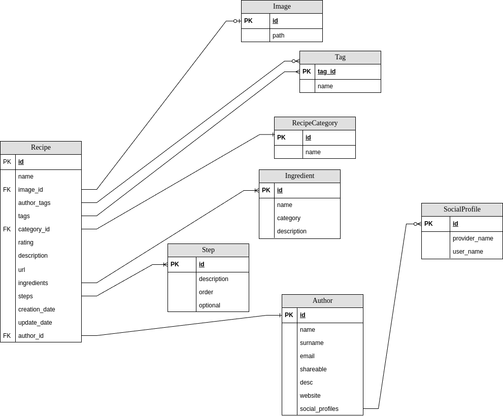

# La Coctelera Entity-Relation Diagram

The following ER diagram depicts the principal actors and relations of the application:

## Tag

The **Tag** entity identifies a set of strings that allow searching recipes in a convenient way. Beyond the main recipe's category, tags would allow establishing links between recipes based on some shared attribute.

Tags are also assigned by two main actors: the recipe's author, and the back-end application. The latter would allow to establish links that an author would rarely make. For instance, if the back-end implements a *featured recipe list*, it could simply mark what recipes belong to such set of featured recipes by the addition of a *featured* tag to the **tags** list.

## RecipeCategory

A controlled set of categories would allow to implement some sort of sorting algorithm that could not be done using tags. Tags might exist, get deleted, or created. Thus relying on them to categorise recipes would be a risky scenario. Rather than using regular tags, we can define a set of fixed categories in which every recipe has to fit in.

Categories shall define disjoint sets of recipes, thus a recipe has to belong to only one category. For example, recipes from baristas or enthusiast.

## Image

An image that helps depicting the cocktail. If no image is provided by the author, a generic one shall be assigned to every recipe.

## Ingredient

An entity that identifies the components of a recipe. This would simplify the recipe's creation process if we offer the author to select already registered ingredients. It also helps establishing links between recipes just checking shared ingredients. However, authors are free to register new ingredients even though a previous alike ingredient already exists in the data base.

Ingredient's category adds an extra way to establish links between recipes and ease searching for common recipes.

## Author

This entity includes all the useful information to create author profiles in the application.

A **shareable** attribute allows authors to select whether they want their profile to be accessible from other people or not.

Social media profiles are also included. Only a set of profiles will be allowed.

## SocialProfile

A list of social media providers included in the application. This is a simple entity that includes the URL of the provider and the author's username in that social media.

## Step

A list of steps to build the recipe. Steps must be ordered, this way, the front-end application will be able to reconstruct the recipe's guidelines properly.

A flag **optional** would allow the author to inform other people whether some steps is really important or not, and it can be skipped with not much impact on the final result.
